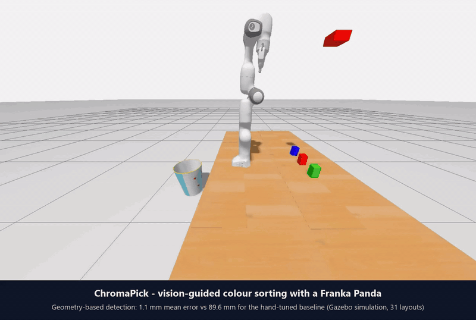

# Franka Panda Color Sorting Robot

[](LICENSE)


A Franka Panda arm that finds coloured objects with a camera and puts each one in the bin for its colour. It runs on ROS 2 Humble,
MoveIt 2 and Gazebo, with OpenCV for the vision.

This repository is an enhanced version of the original
[Franka Panda Color Sorting Robot](https://github.com/MechaMind-Labs/Franka_Panda_Color_Sorting_Robot).
The Panda model and the MoveIt setup come from that project. My changes are the vision pipeline, the way the
picker is driven, and a new simulated work cell. I call the new vision code ChromaPick, mostly so it has a name.
The original code and its original scene are kept (tag `baseline-original`, world `empty`) so the comparison
below can be repeated.

[](docs/demo.mp4)

*One full run in simulation, shown at about five times real speed. Each puck goes to the bin for its colour. Click the animation for the video.*

## What I changed

The original detector turned a pixel into a robot coordinate with a handful of numbers tuned by hand: a fixed
depth of 0.1, a scale factor of -10 on one axis, small offsets for the green and blue boxes, and a -0.60 shift
in the picker. They suit the layout in the original demo and not much else. Move a box a few centimetres and
the arm misses it.

I wanted to see whether the arm could manage without tuned constants, so I replaced them with geometry:

- `camera_geometry.py` turns each pixel into a ray from the camera, using the camera pose from TF, and finds
  where that ray meets the table. The one scene constant left is the height of the object tops (`plane_z`).
- `adaptive_hsv.py` corrects white balance and contrast before thresholding colours, so a change in lighting
  matters less. It takes the centroid of the lit top face only, because a shaded side face pulled the old
  centroid a few millimetres off.
- `pick_and_place.py` accepts `target_colors:=RGB`, so one run sorts several colours in order. Each colour has
  its own drop position above its bin, set with the parameters `drop_position_r`, `_g` and `_b`.
- `evaluate_detectors.py` compares both detectors with the true puck positions from Gazebo, and
  `evaluate_sorting.py` runs complete sorting trials and checks where every puck ends up.
- `table_homography.py` fits a pixel-to-table mapping from point pairs, for cases where the camera pose is not
  known. I only tested this on synthetic data and the demo does not use it.

The old detector is still in the package as `color_detector_legacy`.

### The work cell

I also replaced the scene, so the result does not depend on one particular layout of assets. The new world
(`panda_description/worlds/lab.world`) is built from SDF primitives only, with no external meshes:

- a graphite work table with the Panda mounted on top of it
- three cylindrical pucks (60 mm diameter, 60 mm tall) in red, green and blue
- three open bins behind the robot, one per colour, each with a tinted floor

The original world is still there. Launch it with `world_name:=empty` to reproduce the first set of numbers.

## Results

Detection error is the distance between where a detector puts an object and where Gazebo says it is, in the
robot's base frame. I used 31 layouts each time: the starting layout plus 30 random ones, three objects each.

New scene (pucks):

| | Original detector | New detector |
|---|---|---|
| Objects found | 31 of 93 | 93 of 93 |
| Mean error (mm) | 82.6 (red only) | 1.1 |
| Median error (mm) | 88.6 | 1.1 |
| Worst case (mm) | 163.4 | 1.4 |

The original detector never found a green or blue puck, because its colour bounds are fixed and were tuned for
the old assets. On the red pucks it is off by 8 cm on average. I think the red numbers are the fairer comparison.

Original scene (boxes), measured before I changed the assets:

| | Original detector | New detector |
|---|---|---|
| Mean error (mm) | 89.6 | 1.1 |
| Worst case (mm) | 175.8 | 1.7 |

In that scene the original detector is accurate on the layout it was tuned for (0 to 6 mm), which is why its demo
looks fine. The error grows as the boxes move away from that layout.

Complete sorting runs, new scene: I ran four random layouts, each a full red-green-blue run, and read the final
puck positions from Gazebo. 11 of the 12 pucks ended up in the bin for their colour. In the one miss, a green puck
ended up on the table. I have not run enough trials to put a tight number on the success rate.

The raw data is in [`results/`](results). `ros2 run panda_vision evaluate_detectors` repeats the detector test and
`evaluate_sorting.py` repeats the sorting trials.

## Limitations

- Everything here is simulation. I have not tried it on a real robot or camera.
- The simulated camera has no noise or lens distortion. A real camera would need proper intrinsic calibration,
  and I would expect larger errors.
- `plane_z` is a number I measured in the simulation, so it is still a constant someone has to supply.
- I tested one camera position, cylindrical and box-shaped objects with flat tops, and an uncluttered table.
  Occlusion and other shapes are untested.
- Sorting reliability is based on 12 pucks. Some pucks bounce inside the bins, and I did not try to control that.

Next I would like to try this on a real Panda with a calibrated camera, and see whether a depth camera removes
the need for `plane_z`.

## Running it

```bash
# Terminal 1: Gazebo, MoveIt and the detector
ros2 launch panda_bringup pick_and_place.launch.py

# Terminal 2: sort red, green and blue in order
ros2 run pymoveit2 pick_and_place.py --ros-args -p target_colors:=RGB
```

Setup instructions for Docker and for a native ROS 2 Humble install follow.

## Credits

The original project is by MechaMind Labs: Kumar Utkarsh, Aradhy Agarwal and G2gg. The robot model, the simulation
world, the MoveIt setup and the original colour detector and picker are theirs, and their commit history is
kept in this repository. The `pymoveit2` folder is third-party code by Andrej Orsula.

The vision changes, the evaluation and the multi-colour sorting described above are my work (Abhishek Dubasi).

If you cite this work, GitHub's "Cite this repository" button uses [`CITATION.cff`](CITATION.cff).

---

## Table of contents

1. [Quick start with Docker](#quick-start-with-docker-recommended)
2. [Manual installation on a local PC](#manual-installation-on-local-pc)
3. [Running the project](#running-the-project)
4. [Troubleshooting](#troubleshooting)
5. [References](#references)

---

# Quick Start with Docker (Recommended)

Get up and running in minutes with our pre-built Docker image! This method eliminates dependency conflicts and provides a consistent, production-ready environment.

## Prerequisites

- **Docker** installed on your system
- **X11 display server** (included in most Linux distributions)
- **4GB+ free disk space** for the Docker image
- **Stable internet connection** for pulling the image

---

## Step 1: Install Docker

### On Ubuntu/Debian Linux:

**1.1 Set up Docker's apt repository:**
```bash
# Add Docker's official GPG key:
sudo apt update
sudo apt install ca-certificates curl
sudo install -m 0755 -d /etc/apt/keyrings
sudo curl -fsSL https://download.docker.com/linux/ubuntu/gpg -o /etc/apt/keyrings/docker.asc
sudo chmod a+r /etc/apt/keyrings/docker.asc

# Add the repository to Apt sources:
sudo tee /etc/apt/sources.list.d/docker.sources <<EOF
Types: deb
URIs: https://download.docker.com/linux/ubuntu
Suites: $(. /etc/os-release && echo "${UBUNTU_CODENAME:-$VERSION_CODENAME}")
Components: stable
Signed-By: /etc/apt/keyrings/docker.asc
EOF

sudo apt update
```

**1.2 Install Docker packages:**
```bash
sudo apt install docker-ce docker-ce-cli containerd.io docker-buildx-plugin docker-compose-plugin -y
```

**1.3 Post-installation steps (Run Docker without sudo):**
```bash
# Create docker group (if not exists)
sudo groupadd docker

# Add your user to the docker group
sudo usermod -aG docker $USER

# Activate the changes to groups
newgrp docker

# Log out and back in for changes to take effect
```

**1.4 Verify Docker installation:**
```bash
docker run hello-world
```
**Success!** You should see "Hello from Docker!" message.

---

### On Windows:

1. Download **Docker Desktop** from: [https://www.docker.com/products/docker-desktop](https://www.docker.com/products/docker-desktop)
2. Run the installer and follow the setup wizard
3. Enable **WSL 2** integration when prompted
4. Restart your computer
5. Install **VcXsrv** or **X410** for GUI support

---

### On macOS:

1. Download **Docker Desktop** from: [https://www.docker.com/products/docker-desktop](https://www.docker.com/products/docker-desktop)
2. Drag Docker to Applications folder
3. Launch Docker Desktop
4. Install **XQuartz** for X11 support: `brew install --cask xquartz`

---

## Step 2: Enable GUI Support

Docker containers need permission to access your display for RViz and Gazebo visualization.

```bash
xhost +local:docker
```

**Note:** Run this command each time you restart your computer before launching the container.

---

## Step 3: Run the Docker Container

Pull and start the pre-configured container with all dependencies:

```bash
docker run -it --rm \
  --name franka_panda_color_sorter \
  --network host \
  -e DISPLAY=$DISPLAY \
  -v /tmp/.X11-unix:/tmp/.X11-unix:rw \
  curiousutkarsh/franka_panda_color_sorter:humble bash
```

**Command Breakdown:**
- `--name franka_panda_color_sorter`  Assign a friendly container name
- `--network host`  Share host network for seamless ROS 2 communication
- `-e DISPLAY=$DISPLAY`  Pass display variable for GUI applications
- `-v /tmp/.X11-unix:/tmp/.X11-unix:rw`  Mount X11 socket for graphics
- `curiousutkarsh/franka_panda_color_sorter:humble`  Pre-built Docker image
- `bash`  Start interactive shell

**You're now inside the Docker container!** The workspace is pre-built and ready to use.

---

## Step 4: Launch the System

Once inside the container, open **two terminal sessions**:

### Terminal 1: Launch the Complete System

```bash
# Inside Docker container
source install/setup.bash
ros2 launch panda_bringup pick_and_place.launch.py
```

This launches:
- Gazebo simulation with Panda robot
- RViz motion planning visualization
- Camera and color detection node
- MoveIt 2 motion planning server
- Robot controllers

**Wait for all nodes to initialize** (you'll see "Ready to plan" messages)

---

### Terminal 2: Run Pick-and-Place Node

Open a new terminal and attach to the running container:

```bash
docker exec -it franka_panda_color_sorter bash
```

Inside the new terminal:

```bash
source install/setup.bash
ros2 run pymoveit2 pick_and_place.py --ros-args -p target_color:=R
```

**Color Options:**
- `target_color:=R`  Sort Red objects
- `target_color:=G`  Sort Green objects  
- `target_color:=B`  Sort Blue objects

**Watch the robot detect, pick, and place objects automatically!**

---

## Step 5: Managing the Container

### Switch Target Color:

Stop the pick-and-place node (`Ctrl+C`) and rerun with a new color:

```bash
ros2 run pymoveit2 pick_and_place.py --ros-args -p target_color:=G
```

### Stop the Container:

```bash
# From host terminal (outside Docker)
docker stop franka_panda_color_sorter
```

### Restart Existing Container:

```bash
docker start franka_panda_color_sorter
docker exec -it franka_panda_color_sorter bash
```

### Remove Container:

```bash
docker stop franka_panda_color_sorter
docker rm franka_panda_color_sorter
```

### Pull Latest Image:

```bash
docker pull curiousutkarsh/franka_panda_color_sorter:humble
```

---

## Useful Docker Commands

| Command | Purpose |
|---------|---------|
| `docker ps` | List running containers |
| `docker ps -a` | List all containers (including stopped) |
| `docker images` | List downloaded images |
| `docker system prune` | Clean up unused containers/images |
| `docker logs franka_panda_color_sorter` | View container logs |
| `docker exec -it franka_panda_color_sorter bash` | Attach new terminal |

---

# Manual Installation on Local PC

If you prefer complete control or need to modify the source code, follow this comprehensive setup guide for a local installation.

## Prerequisites

- **Ubuntu 22.04 LTS** (recommended for ROS 2 Humble)
- **16GB+ RAM** (recommended for Gazebo simulation)
- **20GB+ free disk space**
- **Stable internet connection**

---

## Step 1: Install ROS 2 Humble

### 1.1 Set Locale

```bash
sudo apt update && sudo apt upgrade -y
locale  # check for UTF-8

sudo apt install locales
sudo locale-gen en_US en_US.UTF-8
sudo update-locale LC_ALL=en_US.UTF-8 LANG=en_US.UTF-8
export LANG=en_US.UTF-8
```

### 1.2 Setup Sources

```bash
# Add ROS 2 apt repository
sudo apt install software-properties-common -y
sudo add-apt-repository universe
sudo apt update && sudo apt install curl -y

sudo curl -sSL https://raw.githubusercontent.com/ros/rosdistro/master/ros.key -o /usr/share/keyrings/ros-archive-keyring.gpg

echo "deb [arch=$(dpkg --print-architecture) signed-by=/usr/share/keyrings/ros-archive-keyring.gpg] http://packages.ros.org/ros2/ubuntu $(. /etc/os-release && echo $UBUNTU_CODENAME) main" | sudo tee /etc/apt/sources.list.d/ros2.list > /dev/null
```

### 1.3 Install ROS 2 Packages

```bash
sudo apt update
sudo apt install ros-humble-desktop-full -y
```

### 1.4 Environment Setup

```bash
# Source ROS 2 environment
source /opt/ros/humble/setup.bash

# Add to bashrc for automatic sourcing
echo "source /opt/ros/humble/setup.bash" >> ~/.bashrc
source ~/.bashrc
```

### 1.5 Install Development Tools

```bash
sudo apt install python3-rosdep python3-colcon-common-extensions python3-pip -y

# Initialize rosdep
sudo rosdep init
rosdep update
```

---

## Step 2: Install MoveIt 2 and Dependencies

```bash
sudo apt install -y \
  ros-humble-moveit \
  ros-humble-moveit-common \
  ros-humble-moveit-ros-move-group \
  ros-humble-moveit-ros-planning \
  ros-humble-moveit-ros-planning-interface \
  ros-humble-moveit-visual-tools \
  ros-humble-moveit-configs-utils \
  ros-humble-moveit-setup-assistant \
  ros-humble-ros2-control \
  ros-humble-ros2-controllers \
  ros-humble-gazebo-ros2-control \
  ros-humble-ros-gz \
  ros-humble-cv-bridge \
  ros-humble-image-transport \
  ros-humble-rqt-image-view
```

---

## Step 3: Install Python Dependencies

```bash
pip3 install --no-cache-dir \
  opencv-python==4.10.0.84 \
  numpy==1.24.4 \
  transforms3d
```

---

## Step 4: Create and Build Workspace

### 4.1 Create Workspace

```bash
mkdir -p ~/panda_ws/src
cd ~/panda_ws
```

### 4.2 Clone the Repository

```bash
cd ~/panda_ws/src
git clone https://github.com/AbhishekDubasi09/Franka_Panda_Color_Sorting_Robot.git .
```

### 4.3 Install Package Dependencies

```bash
cd ~/panda_ws
rosdep install --from-paths src --ignore-src --skip-keys=opencv_python -r -y
```

### 4.4 Build the Workspace

```bash
colcon build
```

**Note:** Initial build may take 10-15 minutes depending on your system.

### 4.5 Source the Workspace

```bash
source install/setup.bash

# Add to bashrc for convenience
echo "source ~/panda_ws/install/setup.bash" >> ~/.bashrc
```

---

## Step 5: Verify Installation

Test that all packages are properly installed:

```bash
# Check available packages
ros2 pkg list | grep panda

# Expected output:
# panda_bringup
# panda_controller
# panda_description
# panda_moveit
# panda_vision
```

---

## Running the Project

### Complete Pick-and-Place System

Open **two terminal windows**:

#### Terminal 1: Launch System

```bash
source ~/panda_ws/install/setup.bash
ros2 launch panda_bringup pick_and_place.launch.py
```

Wait for all nodes to initialize (~30 seconds)

#### Terminal 2: Start Pick-and-Place

```bash
source ~/panda_ws/install/setup.bash
ros2 run pymoveit2 pick_and_place.py --ros-args -p target_color:=R
```

**Change colors by stopping** (`Ctrl+C`) **and rerunning with different parameter:**

```bash
# For Green objects
ros2 run pymoveit2 pick_and_place.py --ros-args -p target_color:=G

# For Blue objects
ros2 run pymoveit2 pick_and_place.py --ros-args -p target_color:=B
```

---

## Useful ROS 2 Commands

### Monitoring and Debugging

```bash
# List all active nodes
ros2 node list

# List all topics
ros2 topic list

# View camera feed
ros2 run rqt_image_view rqt_image_view

# Echo detected colors
ros2 topic echo /detected_color

# Check robot joint states
ros2 topic echo /joint_states

# Monitor gripper state
ros2 topic echo /panda_gripper/joint_states

# View TF tree
ros2 run rqt_tf_tree rqt_tf_tree

# Visualize computation graph
ros2 run rqt_graph rqt_graph
```

### System Diagnostics

```bash
# Check ROS 2 environment
printenv | grep ROS

# Verify MoveIt installation
ros2 pkg list | grep moveit

# Test motion planning
ros2 launch panda_moveit moveit.launch.py
```

---

# Troubleshooting

## Common Issues and Solutions

### Build Failures

**Error:** `Package 'xyz' not found` during build

**Solutions:**
```bash
# Update rosdep database
rosdep update

# Reinstall dependencies
cd ~/panda_ws
rosdep install --from-paths src --ignore-src -r -y

# Clean and rebuild
rm -rf build/ install/ log/
colcon build
```

---

### Gazebo Won't Start

**Error:** `Gazebo crashes` or `Segmentation fault`

**Solutions:**
```bash
# Reset Gazebo configuration
killall gzserver gzclient
rm -rf ~/.gazebo/

# Check GPU drivers
glxinfo | grep "OpenGL"

# Try software rendering (slower but stable)
export LIBGL_ALWAYS_SOFTWARE=1
ros2 launch panda_bringup pick_and_place.launch.py
```

---

### RViz Display Issues

**Error:** `RViz shows black screen` or crashes

**Solutions:**
```bash
# Reset RViz configuration
rm -rf ~/.rviz2/

# Check display
echo $DISPLAY

# For Docker users
xhost +local:docker
```

---

### MoveIt Planning Failures

**Error:** `Unable to plan` or `No valid plan found`

**Solutions:**
1. Check if all controllers are active:
   ```bash
   ros2 control list_controllers
   ```

2. Verify robot state in RViz
3. Adjust planning time in configuration
4. Check for collisions in scene

---

### Camera Not Publishing

**Error:** No images on `/camera/image_raw` topic

**Solutions:**
```bash
# Check if Gazebo camera plugin loaded
ros2 topic list | grep camera

# Verify camera in Gazebo GUI
# View  World  Models  camera

# Restart launch file
```

---

### Color Detection Not Working

**Error:** No objects detected or wrong colors

**Solutions:**
1. Check HSV thresholds in `color_detector.py`
2. Verify lighting in Gazebo
3. Test with `rqt_image_view`:
   ```bash
   ros2 run rqt_image_view rqt_image_view
   ```
4. Adjust camera position/angle

---

### Docker Container Issues

**Error:** `Cannot connect to display`

**Solution:**
```bash
# Before starting container
xhost +local:docker

# If still failing
xhost +
```

**Error:** `Device or resource busy`

**Solution:**
```bash
# Remove existing container
docker rm -f franka_panda_color_sorter

# Restart Docker service
sudo systemctl restart docker
```

---

## Getting Help

If you encounter issues not covered here:

1. **Check logs:**
   ```bash
   ros2 launch panda_bringup pick_and_place.launch.py --log-level debug
   ```

2. **Search existing issues:**
   [GitHub Issues](https://github.com/AbhishekDubasi09/Franka_Panda_Color_Sorting_Robot/issues)

3. **Create a new issue** with:
   - System info: `uname -a`, `ros2 --version`
   - Error messages
   - Steps to reproduce

---

# Project Structure

```
panda_ws/
├── src/
│   ├── panda_description/        # Robot URDF, meshes, visuals
│   ├── panda_controller/         # Joint/gripper controllers
│   ├── panda_moveit/            # MoveIt 2 configuration
│   ├── panda_vision/            # OpenCV color detection
│   ├── panda_bringup/           # Launch files for full system
│   └── pymoveit2/               # Python MoveIt 2 interface
│       └── examples/
│           └── pick_and_place.py  # Main pick-and-place logic
├── build/                        # Build artifacts
├── install/                      # Installed packages
└── log/                         # Build and runtime logs
```

---

# Package Overview

| Package | Description | Key Files |
|---------|-------------|-----------|
| **panda_description** | Robot model and visualization | `panda.urdf.xacro`, meshes |
| **panda_controller** | Controller configurations | `panda_controllers.yaml` |
| **panda_moveit** | Motion planning setup | MoveIt configs, SRDF |
| **panda_vision** | Computer vision system | `color_detector.py` |
| **panda_bringup** | System launcher | `pick_and_place.launch.py` |
| **pymoveit2** | High-level control | `pick_and_place.py` |

---

# How It Works

## System Architecture

```
Camera Feed  Color Detection  Object Localization
                                        
                                 Motion Planning (MoveIt 2)
                                        
                               Trajectory Execution
                                        
                         Pick Object  Move to Bin  Place
```

## Detailed Workflow

1. **Vision System** continuously monitors the workspace
2. **Color detector** identifies target color and computes 3D position
3. **PyMoveIt2** receives object coordinates
4. **MoveIt 2** plans collision-free trajectory
5. **Robot controller** executes motion
6. **Gripper** closes to grasp object
7. **Motion planner** computes path to sorting bin
8. **Robot** moves to designated area
9. **Gripper** opens to release object
10. **System** returns to home position and repeats

---

# Customization Guide

## Adjust Color Thresholds

Edit `panda_vision/panda_vision/color_detector.py`:

```python
# HSV ranges for different colors
red_lower = (0, 120, 70)
red_upper = (10, 255, 255)
```

## Change Sorting Positions

Modify `pymoveit2/examples/pick_and_place.py`:

```python
# Bin positions (x, y, z)
RED_BIN = [0.5, -0.3, 0.2]
GREEN_BIN = [0.5, 0.0, 0.2]
BLUE_BIN = [0.5, 0.3, 0.2]
```

## Tune Motion Planning

Edit `panda_moveit/config/moveit.yaml`:

```yaml
planning_time: 5.0  # Increase for complex scenes
max_velocity_scaling: 0.5  # Slower = safer
```

---

# References

## Official Documentation
- [ROS 2 Humble](https://docs.ros.org/en/humble/)
- [MoveIt 2](https://moveit.picknik.ai/humble/index.html)
- [Franka Emika Panda](https://frankaemika.github.io/)
- [PyMoveIt2](https://github.com/AndrejOrsula/pymoveit2)
- [Gazebo](https://gazebosim.org/)

## Learning Resources
- [ROS 2 Tutorials](https://docs.ros.org/en/humble/Tutorials.html)
- [MoveIt Tutorials](https://moveit.picknik.ai/humble/doc/tutorials/tutorials.html)
- [OpenCV Python](https://docs.opencv.org/4.x/d6/d00/tutorial_py_root.html)

## Related Projects
- [franka_ros2](https://github.com/frankaemika/franka_ros2) - Official Franka ROS 2 packages
- [moveit2_tutorials](https://github.com/moveit/moveit2_tutorials)
- [ros2_control](https://control.ros.org/)

---

# Contributing

We welcome contributions from the community! Here's how you can help:

### Ways to Contribute

- **Report Bugs**: Open an issue with detailed reproduction steps
- **Suggest Features**: Share your ideas for improvements
- **Improve Documentation**: Fix typos or add clarifications
- **Submit Pull Requests**: Add new features or fix bugs

### Development Workflow

1. Fork the repository
2. Create a feature branch: `git checkout -b feature/amazing-feature`
3. Make your changes and test thoroughly
4. Commit with clear messages: `git commit -m 'Add amazing feature'`
5. Push to your fork: `git push origin feature/amazing-feature`
6. Open a Pull Request with description

---

# License

Released under the MIT License; see [LICENSE](LICENSE). The `pymoveit2/` directory is third-party code by
Andrej Orsula and keeps its own BSD 3-Clause license ([pymoveit2/LICENSE](pymoveit2/LICENSE)).

---

# Acknowledgments

Authors are listed under [Credits](#credits). Thanks to Franka Emika for the Panda robot, the MoveIt community
for the motion-planning framework and the ROS 2 team for the middleware.
