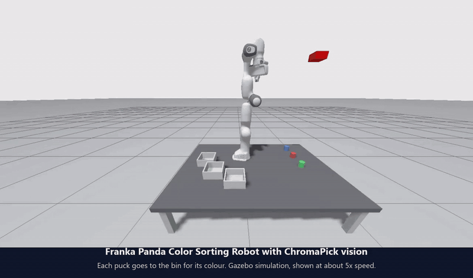

# Franka Panda Color Sorting Robot

[](https://github.com/AbhishekDubasi09/Franka_Panda_Color_Sorting_Robot/actions/workflows/ci.yml)
[](LICENSE)


A Franka Panda arm that finds coloured objects with a camera and puts each one in the bin for its colour. It runs on ROS 2 Humble,
MoveIt 2 and Gazebo, with OpenCV for the vision.

This repository is an enhanced version of the original
[Franka Panda Color Sorting Robot](https://github.com/MechaMind-Labs/Franka_Panda_Color_Sorting_Robot).
The Panda model and the MoveIt setup come from that project. My changes are the vision pipeline, the way the
picker is driven, and a new simulated work cell. I call the new vision code ChromaPick, mostly so it has a name.
The original code and its original scene are kept (tag `baseline-original`, world `empty`) so the comparison
below can be repeated.

[](docs/work-cell-demo.mp4)

*One full run in simulation, shown at about five times real speed. Each puck goes to the bin for its colour. Click the animation for the video.*

## What I changed

The original detector turned a pixel into a robot coordinate with a handful of numbers tuned by hand: a fixed
depth of 0.1, a scale factor of -10 on one axis, small offsets for the green and blue boxes, and a -0.60 shift
in the picker. They suit the layout in the original demo and not much else. Move a box a few centimetres and
the arm misses it.

I wanted to see whether the arm could manage without tuned constants, so I replaced them with geometry:

- `camera_geometry.py` turns each pixel into a ray from the camera, using the camera pose from TF, and finds
  where that ray meets the table. The one scene constant left is the height of the object tops (`plane_z`).
- `adaptive_hsv.py` corrects white balance and contrast before thresholding colours, so a change in lighting
  matters less. It takes the centroid of the lit top face only, because a shaded side face pulled the old
  centroid a few millimetres off.
- `pick_and_place.py` accepts `target_colors:=RGB`, so one run sorts several colours in order. Each colour has
  its own drop position above its bin, set with the parameters `drop_position_r`, `_g` and `_b`.
- `evaluate_detectors.py` compares both detectors with the true puck positions from Gazebo, and
  `evaluate_sorting.py` runs complete sorting trials and checks where every puck ends up.
- `table_homography.py` fits a pixel-to-table mapping from point pairs, for cases where the camera pose is not
  known. I only tested this on synthetic data and the demo does not use it.

The old detector is still in the package as `color_detector_legacy`.

### The work cell

I also replaced the scene, so the result does not depend on one particular layout of assets. The new world
(`panda_description/worlds/lab.world`) is built from SDF primitives only, with no external meshes:

- a graphite work table with the Panda mounted on top of it
- three cylindrical pucks (60 mm diameter, 60 mm tall) in red, green and blue
- three open bins behind the robot, one per colour, each with a tinted floor

The original world is still there. Launch it with `world_name:=empty` to reproduce the first set of numbers.

## Results

Detection error is the distance between where a detector puts an object and where Gazebo says it is, in the
robot's base frame. I used 31 layouts each time: the starting layout plus 30 random ones, three objects each.

New scene (pucks):

| | Original detector | New detector |
|---|---|---|
| Objects found | 31 of 93 | 93 of 93 |
| Mean error (mm) | 82.6 (red only) | 1.1 |
| Median error (mm) | 88.6 | 1.1 |
| Worst case (mm) | 163.4 | 1.4 |

The original detector never found a green or blue puck, because its colour bounds are fixed and were tuned for
the old assets. On the red pucks it is off by 8 cm on average. I think the red numbers are the fairer comparison.

Original scene (boxes), measured before I changed the assets:

| | Original detector | New detector |
|---|---|---|
| Mean error (mm) | 89.6 | 1.1 |
| Worst case (mm) | 175.8 | 1.7 |

In that scene the original detector is accurate on the layout it was tuned for (0 to 6 mm), which is why its demo
looks fine. The error grows as the boxes move away from that layout.

Complete sorting runs, new scene: I ran four random layouts, each a full red-green-blue run, and read the final
puck positions from Gazebo. 11 of the 12 pucks ended up in the bin for their colour. In the one miss, a green puck
ended up on the table. I have not run enough trials to put a tight number on the success rate.

The raw data is in [`results/`](results). `ros2 run panda_vision evaluate_detectors` repeats the detector test and
`evaluate_sorting.py` repeats the sorting trials.

## Limitations

- Everything here is simulation. I have not tried it on a real robot or camera.
- The simulated camera has no noise or lens distortion. A real camera would need proper intrinsic calibration,
  and I would expect larger errors.
- `plane_z` is a number I measured in the simulation, so it is still a constant someone has to supply.
- I tested one camera position, cylindrical and box-shaped objects with flat tops, and an uncluttered table.
  Occlusion and other shapes are untested.
- Sorting reliability is based on 12 pucks. Some pucks bounce inside the bins, and I did not try to control that.

Next I would like to try this on a real Panda with a calibrated camera, and see whether a depth camera removes
the need for `plane_z`.

## Running it

```bash
# Terminal 1: Gazebo, MoveIt, controllers and the detector
ros2 launch panda_bringup pick_and_place.launch.py

# Terminal 2: sort red, green and blue in order, once the first terminal has settled
ros2 run pymoveit2 pick_and_place.py --ros-args -p target_colors:=RGB
```

This needs ROS 2 Humble, MoveIt 2 and Gazebo. The install steps are in [`docs/INSTALL.md`](docs/INSTALL.md).

## Documentation

- [Installation](docs/INSTALL.md): native install and Docker
- [Usage](docs/USAGE.md): launch arguments, parameters, how to repeat the evaluation, customisation
- [How it works](docs/ARCHITECTURE.md): packages, data flow, frames and the numbers behind them
- [Troubleshooting](docs/TROUBLESHOOTING.md): the problems I hit and what fixed them
- [Changelog](CHANGELOG.md)

## Tests

The vision code has unit tests that need only Python, NumPy and OpenCV, so they run without ROS:

```bash
pip install numpy opencv-python-headless pytest
PYTHONPATH=panda_vision python -m pytest panda_vision/test/test_self_calibration.py
```

They run automatically on every push (see the CI badge above). The simulation itself is not part of the automated checks.

## Credits

The original project is by MechaMind Labs: Kumar Utkarsh, Aradhy Agarwal and G2gg. The robot model, the simulation
world, the MoveIt setup and the original colour detector and picker are theirs, and their commit history is
kept in this repository. The `pymoveit2` folder is third-party code by Andrej Orsula.

The vision changes, the evaluation, the multi-colour sorting and the new work cell described above are my work
(Abhishek Dubasi).

If you cite this work, GitHub's "Cite this repository" button uses [`CITATION.cff`](CITATION.cff).

## Licence

Released under the MIT licence, see [LICENSE](LICENSE). The `pymoveit2/` directory keeps its own BSD 3-Clause licence
([pymoveit2/LICENSE](pymoveit2/LICENSE)). Third-party notices are in [NOTICE](NOTICE).
